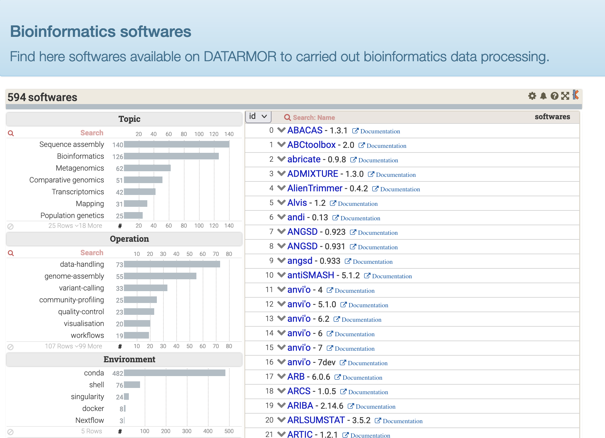

# ToolDirectory
## Introduction

ToolDirectory provides a convenient tool to display list of softwares in a webpage along with dynamic data filtering capabilities.



You can test our [public demo](https://ifremer-bioinformatics.github.io/ToolDirectorySample/)

## Direct use of ToolDirectory Viewer

The only step you have to achieve consists in creating a specific CSV file, listing all your softwares along with some metadata, such as EDAM terms, links to documentation, etc. An example is provided in test file [Sotwares.csv](test/Softwares.csv).

Then, review this fully running example of ToolDirectory Viewer tool : [ToolDirectory Viewer at work](https://github.com/ifremer-bioinformatics/ifremer-bioinformatics.github.io/tree/master/ToolDirectorySample), you'll see how a Softwares.csv file is used. 

That's all folks to use the Viewer.

Now, to create the CSV file requested by the Viewer in a fully automated way, ToolDirectory provides a few tools, hereafter presented.

## Installation of ToolDirectory to manage softwares

ToolDirectory provides tools to handle a catalogue of softwares relying on a particular way of installating softwares on your system (see below, Expected directory structure).

This tool is a Python 3.x program. It also requires the following packages used to build the HTML report:

* Pandas (tested with release 0.21)
* Jinja2 (tested with release 2.9.6)
* Requests (tested with release 2.25.1)

```
conda create -p tooldir-v3.0 -c jinja2 pandas requests
```

Web rendering relies on the open-source version of [Keshif](https://github.com/adilyalcin/Keshif) data visualisation. We provided [Katalog](https://gitlab.ifremer.fr/bioinfo/katalog), a lightweight version specifically designed for ToolDirectory and DataDirectory.

## Basic usage

```bash
$ tooldir -h
usage: tooldir <command> [<args>]
            The available commands are:
            create   Create tool properties
            update   Update tool properties (add new key(s), change values)
            upgrade  Upgrade tool properties to JSON (v2 -> v3)
            kcsv     Create csv for visualisation
            khtml    Create core webpage for visualisation
```

## Prepare your Directory
### 1 - Expected directory structure

Tool Directory expects a directory structure with the following constraints:

- \<install-dir>/\<tool>/\<version>/

Here is an example:

```
/appli/bioinfo
  ├── blast
  │    ├── 2.2.31
  │    └── 2.6.0
  ├── plast
  │    └── 2.3.2
  ├── beedeem
  │    └── 4.3.0
  .../...
```
### 2a - Declaring your softwares

To declare your softwares to Tool Directory you just have to setup a propertie file, one per software. It contains the description of a single software and it has to follow these two constraints

* file must be called ```properties.json```
* file is located within home directory of a software

Example:
```
{
  "NAME": "PLAST",
  "DESCRIPTION": "High Performance Parallel Local Alignment Search Tool",
  "VERSION": "2.3.3",
  "CMDLINE": "true",
  "GALAXY": "true",
  "URLDOC": "https://plast.inria.fr/user-guide/",
  "KEYWORDS": "sequence-similarity-search",
  "CMD_INSTALL": "shell",
  "TOPIC": "Biological databases",
  "DATE_INSTALL": "11/07/2018",
  "OWNER": "galaxy"
}
```
Keys explanation:

```
NAME: the name of the software
DESCRIPTION: a short one line description of the software
VERSION: the release tag of the software
CMDLINE: software available on the command-line? (only use one of: true, false)
GALAXY: software available on GALAXY Workflow platform? (only use one of: true, false)
URLDOC: URL to the user manual
KEYWORDS: one or several keywords to classify your software using EDAM Operation terms
TOPIC: one or several keywords to classify your software using EDAM Topic terms
CMD_INSTALL: the way a tool is installed. (one of: conda, docker, shell)
OWNER: person who installed the software
```

A list of JSON files is available in `test/catalogue`.

### 2b - Automatic creation of properties using Bio.tools API

To be consistent between the descriptions of your softwares, we strongly recommend to use the Bio.tools database using ```tooldir create```

```bash
tooldir create -n bowtie2 -v 2.3.5 -o username
```
By default, it will search for the parameter file into  ```~/.tooldir.params``` which contains the structure of your install environment, as follow:

```
{
    "install_dir_path": "/foo/bar/",
    "conda_envs_path": "/foo/tools_env/",
    "anaconda_dir_path": "/foo/anaconda/<versions>/",
    "anaconda_profile_d": "/foo/anaconda/<versions>/etc/profile.d/conda.sh",
    "topics":
        [
            "Bioimaging",
            "Bioinformatics",
            "Biological databases",
            "Comparative genomics",
            "Data visualisation",
            "Statistics and probability",
            "Structure analysis",
            "Transcriptomics"
        ]
}
```

And you can indicate a restrictive list of allowed topics.

### 3 - Setup visualisation

You will need [Katalog](https://gitlab.ifremer.fr/bioinfo/katalog), a lightweight version of [Keshif](https://github.com/adilyalcin/Keshif) specifically designed for ToolDirectory and DataDirectory.


```bash
git clone https://gitlab.ifremer.fr/bioinfo/katalog.git /foo/bar/www/tooldirectory
```

Then, configure ToolDirectory and generate the software list:
```bash
# At the first utilization, generate a html webpage for visualization
tooldir khtml -i webpage.json -p /path/to/www/katalog/

# Generate csv file for Keshif visualization, at first time and for each update
tooldir kcsv -p /path/to/softwares/ -o /foo/bar/www/tooldirectory/Softwares.csv
```

You can use a crontab to automatically update the software listing.

## Licenses

Tool Directory is released under the terms of the Apache 2 license.
