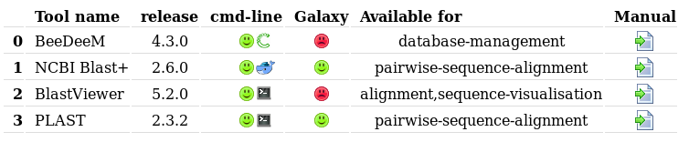
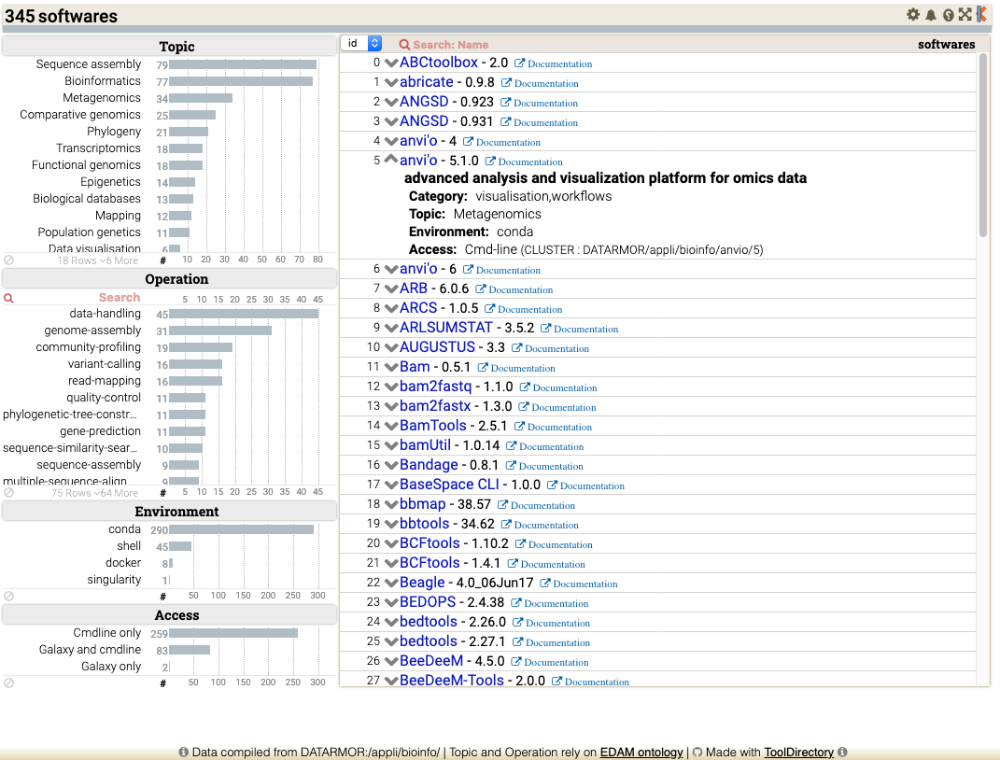

# Tool Directory Software

## Introduction

This package provides an easy and convenient tool to display in a graphical way list of softwares installed on a computer. 

Tool Directory was originally designed to provide a summary of all bioinformatics tools installed on the DATARMOR supercomputer at IFREMER.

ToolDirectory provides a convenient way to go from an "ugly" terminal listing:
```
/path/to/bioinfo-softwares
  ├── blast
  │    ├── 2.2.31
  │    └── 2.6.0
  ├── plast
  │    └── 2.3.2
  ├── beedeem
  │    └── 4.3.0
  .../...
```

to nice views to be presented on a web page for your users.

**Two views are available**: 
- a simple web page (since ToolDirectory v1)
- a dynamic data exploration viewer (introduced with ToolDirectory v2). 

### The simple web viewer

This is a basic HTML Table aims at providing a clear overview of software name and version, software classification keywords and direct link to documentation. It is available since Tool Directory first release.



### The dynamic data exploration viewer

It provides an extensive presentation of bioinformatics softwares along with data filtering features relying on [EDAM](https://ifb-elixirfr.github.io/edam-browser) Topic and Operation terms. It was introduced with Tool Directory release 2.0.



## Dependencies

This tool is a Python 3.x program. It also requires the following packages used to build the HTML report:

* Pandas (tested with release 0.21)
* Jinja2 (tested with release 2.9.6)

Depending on your host configuration you can install these dependencies using either Python package manager or Conda. At IFREMER, we use conda and we had setup a Conda environment as follows:

```
conda create -n ToolDirectory-2.0
source activate ToolDirectory-2.0
conda install -c python=3.6 Jinja2 pandas
```

Tool Directory also relies on the open-source version of [Keshif](https://github.com/adilyalcin/Keshif) data visualisation, included in this package, i.e. you do not have to install it.

## Prepare your Directory

### What is a directory?

This is simply the place (*i.e.* a folder on your computing system) where your (bioinformatics) softwares are installed; while Tool Directory was designed to handle a catalog of bioinformatics tools, is can be used for any other software lisiting.

### Expected directory structure

Tool Directory expects a directory structure with the following constraints:

* **directory** is a folder on your computing system; let's call it *tool-home-dir*
* all softwares to be listed are located in sub-folders of *tool-home-dir*
* softwares having different releases are also organized using sub-folders

Here is an example of a simple *tool-home-dir*:

```
/appli/bioinfo
  ├── blast
  │    ├── 2.2.31
  │    └── 2.6.0
  ├── plast
  │    └── 2.3.2
  ├── beedeem
  │    └── 4.3.0
  .../...
```
### Declaring your softwares

Now, to declare your softwares to Tool Directory you just have to setup Property files, one per software. Such a Property file contains the description of a single software (see below) and it has to follow these two constraints

* file must be called "tool.properties"
* file is located within home directory of a software

For instance, considering our PLAST 2.3.2 installation (see above directory tree structure), we have setup a file called "tool.properties" located in /appli/bioinfo/plast/2.3.2.

Here is the content of "tool.properties" for PLAST 2.3.2:

```
NAME=PLAST
DESCRIPTION=High Performance Parallel Local Alignment Search Tool
VERSION=2.3.2
CMDLINE=true
GALAXY=true
URLDOC=https://plast.inria.fr/user-guide/
KEYWORDS=pairwise-sequence-alignment
CMD_INSTALL=shell
```
As you can see this is basically a set of key=value pairs. Keys are reserved case-sentive words and values are set by you.

Here is such a Property file explained:

```
NAME: the name of the software
DESCRIPTION: a short one line description of the software
VERSION: the release tag of the software
CMDLINE: software available on the command-line? (only use one of: true, false)
GALAXY: software available on GALAXY Workflow platform? (only use one of: true, false)
URLDOC: URL to the user manual
KEYWORDS: one or several keywords to classify your software using EDAM Operation terms
TOPIC: one or several keywords to classify your software using EDAM Topic terms
CMD_INSTALL: the way a tool is installed. (one of: conda, docker, shell)
```
All but GALAXY keys are valid to describe your softwares, whatever their field of application. Then, regarding KEYWORDS values, we rely on the EDAM-operation names (see http://edamontology.org/page). It is up to you to choose whatever naming system appropriate to classify your tools.

For a complete list of example of such 'tool.properties' files, look at .

### Modifying keys in Property files

Maybe you could be interested in adding, removing or renaming the keys of a Property file. Of course, this is possible: just edit the Python source code of Tool Directory and adapt it to your needs. The source code is fully documented and it should be easy to modify it.

In a similar way, you can add more CMD_INSTALL values. If you do so, just ensure that you add the corresponding image in the images folder. For instance, the value docker is associated to images/docker.png file.

## Tool Directory use

### Testing the tool

You can test the tool as follows:

```
cd scripts
./make-html-directory.py -o test.html
```
Then open "test.html" in your web browser. You should see sometjing like this:


### Using the tool with your software listing

You use Tool Directory in a very straightforward way:

```
cd scripts
./make-html-directory.py -p <directory> -o my-listing.html

where:
     directory: root directory of your software installation; considering our
                sample directory tree structure (see above), we will use:
                -d /appli/bioinfo
     my-listing.html: the list of your software, Html/Table formatted; use a
                file name as needed
```

## Setup the simple HTML based view

Simply uses the procedure described in the Testing section, above.

## Setup the data exploration view

### Prepare the dynamic viewer basic files

Steps to execute one time  are
- On your web server, locate the 'www' directory, then create a sub-folder, e.g. 'tool-directory' ;
- Copy content of 'thirdparty/Keshif/*' into 'www/tool-directory' ;
- Copy file 'css/software_browser.css' into 'www/tool-directory' ;
- Edit file 'template/example.lst' and update field values to match your system ;
- Run script 'scripts/generateWebPage.py' to generate html template into 'www/tool-directory' ;

### Prepare the CSV file required by the viewer

- Run script 'scripts/make-csv-directory.py' to prepare CSV file' and place it into 'www/tool-directory'.

That step has to be executed each time yout install a new software into your repository of tools; at Ifremer, we use a cron task.

## Licenses

Tool Directory is released under the terms of the Apache 2 license.

Tool Directory data exploration viewer uses the open-source version of [Keshif](https://github.com/adilyalcin/Keshif), a web-based data exploration environment for data analytics. Keshif open-source is released under the terms of the BSD-3 clause license.

