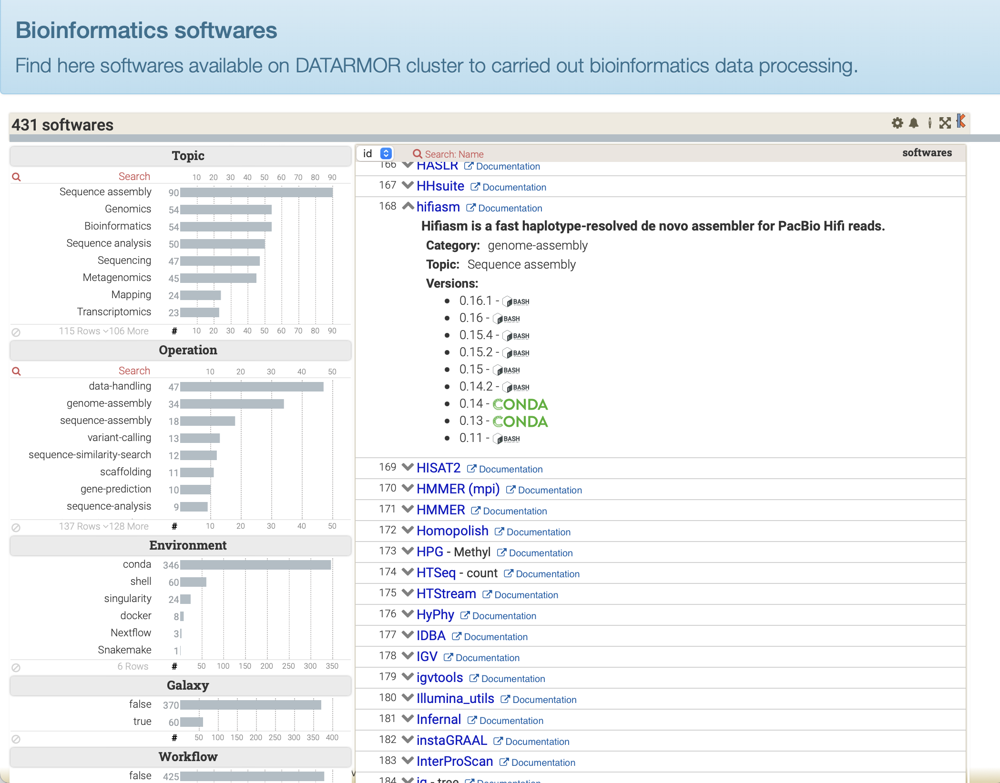

# ToolDirectory
## Introduction

ToolDirectory provides a convenient tool to display list of softwares in a webpage along with dynamic data filtering capabilities.



You can test our [public demo](https://ifremer-bioinformatics.github.io/ToolDirectorySample/)

## Direct use of ToolDirectory Viewer

The only step you have to achieve consists in creating a specific CSV file, listing all your softwares along with some metadata, such as EDAM terms, links to documentation, etc. An example is provided in test file [Softwares.csv](test/Softwares.csv).

Then, review this fully running example of ToolDirectory Viewer tool : [ToolDirectory Viewer at work](https://github.com/ifremer-bioinformatics/ifremer-bioinformatics.github.io/tree/master/ToolDirectorySample), you'll see how a Softwares.csv file is used. 

That's all folks to use the Viewer.

Now, to create the CSV file requested by the Viewer in a fully automated way, ToolDirectory provides a few tools, hereafter presented.

## Installation of ToolDirectory to manage softwares

ToolDirectory provides tools to handle a catalogue of softwares relying on a particular way of installating softwares on your system (see below, Expected directory structure).

ToolDirectory is a Python 3.x program. It also requires the following package:

* Requests v2.25.1

```
conda create -p tooldir -c anaconda requests=2.25.1
```

Web rendering relies on the open-source version of [Keshif](https://github.com/adilyalcin/Keshif) data visualisation. We provided [Katalog](https://gitlab.ifremer.fr/bioinfo/katalog), a lightweight version specifically designed for ToolDirectory and DataDirectory.

## Basic usage

```bash
$ tooldir -h
usage: tooldir <command> [<args>]
            The available commands are:
            create   Create tool properties
            status   Set installation status of tool/version
            kcsv     Create csv for visualisation
```

## Prepare installation
### 1 - Expected structure

ToolDirectory expects a directory structure with the following constraints:
- \<install-dir>/\<tool>/\<version>/

Or, with [modules](http://modules.sourceforge.net/) architecture:
- \<install-dir>/\<tool>/<version-module>

Here is an example:

```
/path/to/softwares
  ├── blast
  │    ├── 2.2.31 #folder or module
  │    └── 2.6.0
  ├── plast
  │    └── 2.3.2
  ├── beedeem
  │    └── 4.3.0
  .../...
```

### 2 - Creation of tool description using Bio.tools API

```bash
tooldir create -n <toolname> -v <version> -o <username>
```

### 3 - Setup visualisation

You will need [Katalog](https://gitlab.ifremer.fr/bioinfo/katalog), a lightweight version of [Keshif](https://github.com/adilyalcin/Keshif) specifically designed for ToolDirectory and DataDirectory.


```bash
git clone https://gitlab.ifremer.fr/bioinfo/katalog.git /foo/bar/www/tooldirectory
```

Then, generate the software list:
```bash
tooldir kcsv -p /path/to/softwares/ -o /foo/bar/www/tooldirectory/Softwares.csv
```

You can use a crontab to automatically update the software listing.

## Licenses

Tool Directory is released under the terms of the Apache 2 license.
